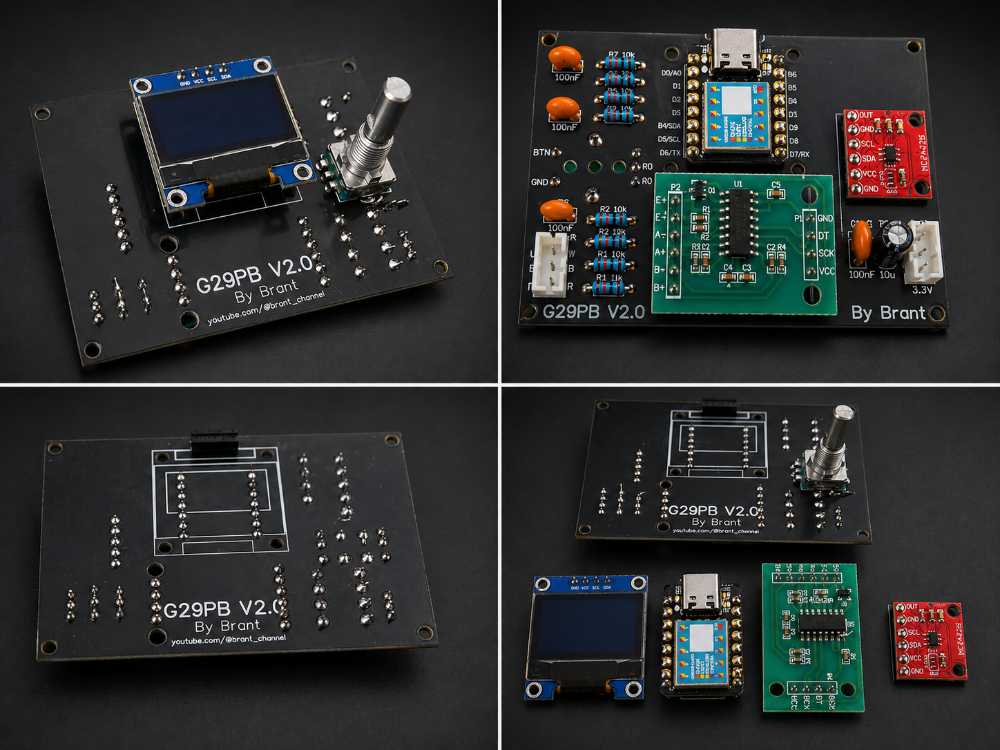

# G29 Load Cell Brake Controller (G29PB v2.0)

A high-performance load cell brake upgrade for the Logitech G29, designed to deliver realistic, pressure-based braking with precision, consistency, and adjustability.

<p align="center">
  
</p>

---

## 🚀 Overview

The G29PB replaces the stock potentiometer-based brake with a load cell system, transforming braking from position-based input into pressure-based control.

This results in:

* More realistic braking feel
* Better consistency lap after lap
* Improved muscle memory and control

---

## 📸 Hardware

<p align="center">
  
</p>

### PCB Top Layer

<p align="center">
  
</p>

### PCB Bottom Layer

<p align="center">
  
</p>

---

## 🔥 Key Features

* Load cell-based braking (pressure instead of travel)
* HX711 amplifier with high-speed sampling (80Hz)
* 12-bit analog output via MCP4725 DAC (0–3.3V)
* Adjustable sensitivity via potentiometer
* Adjustable response curve shaping
* Real-time feedback via OLED display
* Compact all-in-one PCB design
* Clean wiring with dedicated connectors

---

## 🧰 Hardware Architecture

* Arduino Nano
* HX711 Load Cell Amplifier
* MCP4725 DAC
* 128x64 OLED Display (I2C)
* Potentiometers:

  * Sensitivity adjustment
  * Curve shaping

---

## 🧠 Design Philosophy

This project prioritizes:

* Fast response over extreme precision
* Driver consistency over raw measurement accuracy
* Simple and reliable calibration
* Hardware-based adjustments (no need to reflash firmware)

---

## 🔌 PCB Design

* Version: **G29PB v2.0**
* Compact and integration-friendly layout
* Optimized routing for signal stability
* Decoupling capacitors for noise reduction
* Dedicated connectors for easy installation

---

## ⚙️ Firmware

Located in `/firmware`

Main features:

* Real-time load cell reading (80Hz)
* Dynamic scaling of input force
* DAC output mapping (0–3.3V)
* Adjustable behavior via potentiometers
* OLED visualization of braking response

---

## 🧪 Calibration

See `/calibration/procedures.md`

Highlights:

* Repeatable manual calibration process
* Stable readings prioritized over absolute precision
* No EEPROM dependency (simplified system)

---

## 🧩 3D Printed Load Cell Adapter

To properly integrate the load cell into the G29 pedal, a custom 3D-printed adapter is used.

<p align="center">
  
  
</p>

<p align="center">
  
  
</p>

### 🖨️ 3D Printing Files

All STL files required for printing are available in:

```
/0 3D files/
```

---

## 📦 Repository Contents

* Firmware source code (.ino)
* EasyEDA design files (.json)
* Schematics (PDF)
* PCB layout and Gerbers
* 3D models and STL files
* Documentation and calibration guide

---

## 🎯 Use Case

Designed for sim racers who want:

* Realistic braking feel
* Better trail braking control
* Consistency under pressure
* A DIY solution with professional-level performance

---

## 🤝 Contributing

Contributions are welcome.
Feel free to fork, improve, and share your version.

---

## 📄 License

Licensed under the Apache License 2.0

---

## ❤️ Support the Project

If you found this project useful, consider supporting:

* Subscribe: https://youtube.com/@brant_channel
* Share your build with the community
